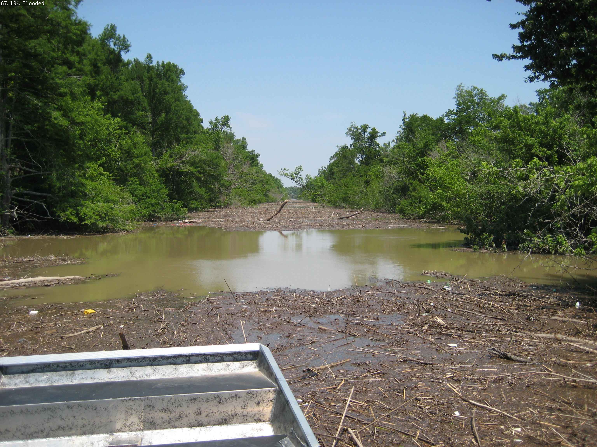
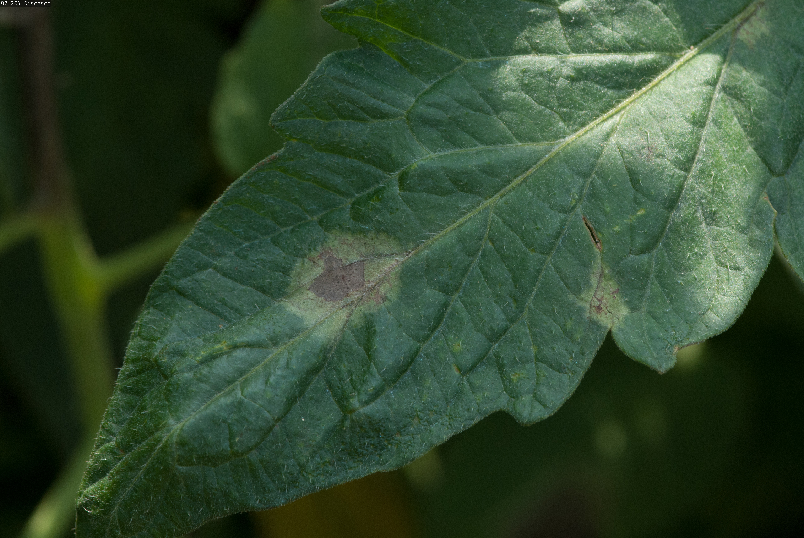

# Dennis-Project
# FloodRoad and LeafGuard

FloodRoad and LeafGuard are two AI image classification tools made for the NVIDIA Jetson Orin Nano.

- **FloodRoad** classifies a road as `Flooded` or `Normal`. This can help emergency workers find dangerous roads after a storm.
- **LeafGuard** classifies a tomato leaf as `Diseased` or `Healthy`. This can help a plant owner notice a problem before the plant becomes badly damaged.

Both tools can classify saved images or use a USB webcam for live results.





## Datasets

The road images came from Kaggle flood and road datasets. The final leaf dataset uses real-world tomato leaf images from the Tomato PlantDoc dataset. Images were placed into the correct class folders and split into `train`, `val`, and `test` folders with the Gameplan `split-dataset.py` program.

Dataset references:

- [Roadway Flooding Image Dataset](https://www.kaggle.com/datasets/saurabhshahane/roadway-flooding-image-dataset)
- [Road Condition Alert Dataset](https://www.kaggle.com/datasets/saadkhan0/road-conditionalert-dataset)
- [Flood Classification Dataset](https://www.kaggle.com/datasets/dhawalsrivastava2583/flood-classification-dataset)
- [Tomato PlantDoc Dataset](https://www.kaggle.com/datasets/abdulhasibuddin/tomatoplantdocdataset)


## Project Files

```text
python/training/classification/
|-- data/
|   |-- floodroad/
|   |-- leafguard_v2/
|   |-- road_camera.py
|   `-- leaf_camera.py
|-- models/
|   |-- floodroad/resnet18.onnx
|   `-- leafguard_v2/resnet18.onnx
|-- train.py
`-- onnx_export.py
```

## The Algorithm

Both projects use image classification and transfer learning with a ResNet-18 deep neural network. ResNet-18 was already trained to recognize image features such as shapes, colors, and textures. I retrained it with my own two-class datasets so it could solve these new problems.

The datasets are divided into three folders:

- `train` teaches the model.
- `val` checks the model during training.
- `test` checks the finished model with images it did not train on.

The FloodRoad classes are `Flooded` and `Normal`. The LeafGuard classes are `Diseased` and `Healthy`. I tested the finished models with images that were not used for training, including real-world images with natural backgrounds.

The `train.py` program retrains each model. The `onnx_export.py` program changes the trained model into ONNX format so Jetson Inference can run it. The final model files are:

```text
python/training/classification/models/floodroad/resnet18.onnx
python/training/classification/models/leafguard_v2/resnet18.onnx
```

For live video, `road_camera.py` and `leaf_camera.py` read frames from `/dev/video0`. The model classifies each frame and returns a class name and confidence score. The result is written on the frame and sent to a browser with WebRTC on port `8554`.


## Training the Models

The NVIDIA Jetson Orin Nano, JetPack, `jetson-inference`, Python 3, Docker, and the image datasets are required.

1. Open a terminal and start the Jetson Inference Docker container.

```bash
cd ~/jetson-inference
./docker/run.sh
```

2. Go to the classification training folder inside Docker.

```bash
cd /opt/jetson-inference/python/training/classification
```

3. Train both models.

```bash
python3 train.py --model-dir=models/floodroad data/floodroad
python3 train.py --model-dir=models/leafguard_v2 data/leafguard_v2
```

4. Export both models to ONNX.

```bash
python3 onnx_export.py --model-dir=models/floodroad
python3 onnx_export.py --model-dir=models/leafguard_v2
```

5. Check that both ONNX files were created.

```bash
ls models/floodroad/resnet18.onnx
ls models/leafguard_v2/resnet18.onnx
```

## Running This Project

### Test FloodRoad Images

```bash
cd /opt/jetson-inference/python/training/classification

imagenet --model=models/floodroad/resnet18.onnx \
  --input_blob=input_0 --output_blob=output_0 \
  --labels=data/floodroad/labels.txt \
  data/floodroad/test/Flooded data/floodroad/test_output_flooded

imagenet --model=models/floodroad/resnet18.onnx \
  --input_blob=input_0 --output_blob=output_0 \
  --labels=data/floodroad/labels.txt \
  data/floodroad/test/Normal data/floodroad/test_output_normal
```

### Test LeafGuard Images

```bash
cd /opt/jetson-inference/python/training/classification

imagenet --model=models/leafguard_v2/resnet18.onnx \
  --input_blob=input_0 --output_blob=output_0 \
  --labels=data/leafguard_v2/labels.txt \
  data/leafguard_v2/test/Healthy data/leafguard_v2/test_output_healthy

imagenet --model=models/leafguard_v2/resnet18.onnx \
  --input_blob=input_0 --output_blob=output_0 \
  --labels=data/leafguard_v2/labels.txt \
  data/leafguard_v2/test/Diseased data/leafguard_v2/test_output_diseased
```

### Run FloodRoad With a Webcam

Connect the USB webcam and run:

```bash
python3 data/road_camera.py \
  --input=/dev/video0 \
  --input-codec=mjpeg \
  --input-width=1280 \
  --input-height=720 \
  --input-rate=30 \
  --output=webrtc://@:8554/road \
  --output-codec=h264 \
  --headless
```

### Run LeafGuard With a Webcam

Stop FloodRoad with `Ctrl+C`, then run:

```bash
python3 data/leaf_camera.py \
  --input=/dev/video0 \
  --input-codec=mjpeg \
  --input-width=1280 \
  --input-height=720 \
  --input-rate=30 \
  --output=webrtc://@:8554/leaf \
  --output-codec=h264 \
  --headless
```

Open `http://JETSON_IP:8554` in Google Chrome. Only run one webcam program at a time. If the terminal says it cannot resolve a random `.local` address, open `chrome://flags/#enable-webrtc-hide-local-ips-with-mdns`, set **Anonymize local IPs exposed by WebRTC** to **Disabled**, and relaunch Chrome.

## Results and Limits

The models work well on many test images, but they are not perfect. FloodRoad may have trouble when a normal road is wet or when flood water is hard to see. LeafGuard may have trouble when the leaf is very small, blurry, dark, or different from the tomato leaves in the training dataset. These tools should help a person make a decision, but they should not replace an expert or an official safety warning.

## Video Demonstration

[View the final video demonstration here](ADD_FINAL_VIDEO_LINK_HERE)

## References

- [Jetson Inference](https://github.com/dusty-nv/jetson-inference)
- iD Tech Gameplan: NVIDIA AI and Machine Learning Academy
- Kaggle datasets listed above
